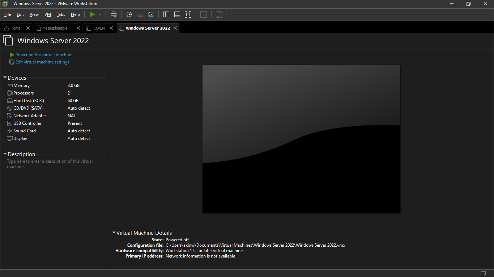
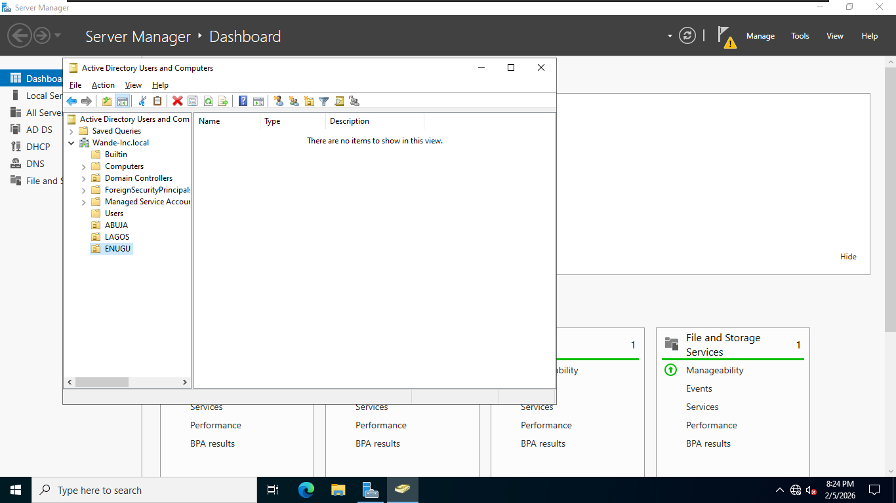
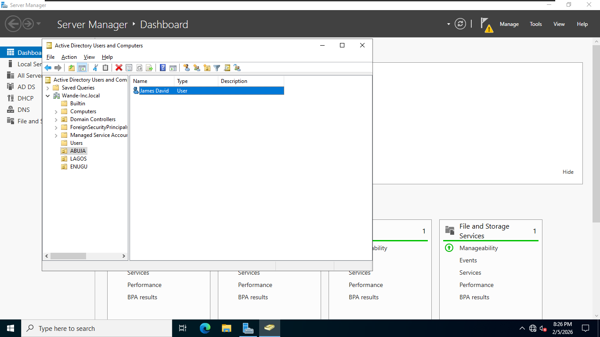

# Project Overview
Hands-on lab simulating a small enterprise domain using VMware Workstation Pro and Windows Server 2022 Evaluation Edition (ISO from Microsoft Eval Center). Goals: Install AD DS, promote to Domain Controller, design OU structure, manage users/groups, and apply Group Policies.

# Step-by-Step Guide: Setting Up Active Directory and Organizational Units on Microsoft Windows Server
# Introduction :
This guide covers installing AD DS, creating OUs, users, and groups on Windows Server 2022        

# Prerequisites

## Hardware Requirements.
1.	CPU Type: Intel Core i5-6300U
2.	CPU Speed: 2.40GHz-2.80GHz.
3.	RAM: 8GB.
4.	Storage: 256GB SSD.

## Software Requirements.
1.	Windows 10 Operating system(Or equivalent Linux/Mac os).
2.	[Windows 2022 Server ISO. ](https://www.microsoft.com/en-us/evalcenter/download-windows-server-2022)
3.	[VMWare Workstation pro (Or equivalent Hypervisor e.g Virtualbox, Microsoft Hyper-v).](https://knowledge.broadcom.com/external/article/344595/downloading-vmware-workstation-pro.html)

## Network 
NAT for internet, Static IP is recommended, as it is used for a server not a client

# Step-by-Step Setup

## Create VM in VMware Workstation Pro.
   - Launch VMware Workstation.
   - Click on Create a new virtual machine.
   - Select Typical.
   - Installer disc image (ISO) → Select your Windows Server 2022 ISO  from the location on your hard drive
   - Guest OS: Microsoft Windows → Windows Server 2022  
   - Configure hardware: 4+ GB RAM, 2+ cores, network adapter (NAT)  

   - Install OS normally (choose Datacneter Evaluation with Desktop Experience if desired.)

## Initial Server Configuration
   - Set static IP (e.g., 192.168.x.10/24, the gateway address can be found by running the ipconfig command on CMD).  
   - Rename the server (e.g., DC01) and restart .
   - Update Windows if possible

## Install Active Directory Domain Services.
   - Open Server Manager → Manage → Add Roles and Features  
   - Select Role based/ Feature based Installation.
   - Select the server which you just renamed.
   - Select "Active Directory Domain Services, DHCP & DNS" → Install (includes management tools)  
   - After installation, click the notification flag → Promote this server to a domain controller.

## Promoting to a Domain Controller
   - Select Add a new forest and input a name of your desire(end the name with ".local" e.g testlab.local) and click next
   - Enter a password of your choosing and Select Forest and domain functional level to Windows Server 2016 and click next
   - Skip the "Create Dns delegation" and click next.
   - Verify the NetBios name and click next     
   - Verify the Directory paths and click next.
   - Review your options and click next.
   - Verify the prerequisites check was passed successfully and click next.
   - The installation process would take about 5 minutes and automatically restart the server.

## Creating Organizational Units (OUs).
   - From the server manager, click on tools and select Active Directory Users and Computers.
   - Right-Click on the domain name which you created earlier (testlab.local) → New → Organizational Unit  and give it a name of your choosing.- Example structure:  
     - Company  name
       - Departments  
         - IT  
         - HR  
         - Sales  
       - Users  
       - Groups  
 
## To create users/groups and assign to OU's
   - New → User (e.g., in IT OU)  
   - New → Group (e.g., IT-Admins – Global/Security)  
  

## Group Policy Basics
   - Open Group Policy Management (gpmc.msc)  
   - Create GPO → Link to OU (e.g., password policy for IT OU)  
   - Edit: Computer/User Configuration → Policies → Windows Settings → Security Settings
